# Report 2: System Analysis & Architectural Design Report
## Design Phase - Online Education Task Management System

---

## 1. System Overview

### 1.1 Purpose and Functionality
The **Online Education Task Management System** is a comprehensive desktop application designed to streamline the educational workflow between administrators, teachers, and students. The system facilitates:

- **Assignment Management**: Teachers can create, distribute, and grade assignments
- **Student Submission Tracking**: Students can view, submit, and track their assignments
- **Administrative Control**: Complete management of users, classes, subjects, and system configuration
- **AI-Powered Features**: Automated grading suggestions and feedback generation using Google Gemini AI

### 1.2 Intended Users
The system serves three primary user roles:

1. **Administrators**
   - System configuration and oversight
   - User account management (teachers and students)
   - Class and subject administration
   - System-wide statistics and reporting

2. **Teachers**
   - Assignment creation and distribution
   - Submission review and grading
   - Student performance tracking
   - Class and subject management

3. **Students**
   - Assignment viewing and submission
   - Grade and feedback tracking
   - Subject enrollment overview
   - Submission history management

### 1.3 Target Platform
- **Platform**: Windows Desktop (Windows 10/11)
- **Framework**: .NET 8.0
- **UI Technology**: WPF (Windows Presentation Foundation)
- **Database**: Microsoft SQL Server
- **Architecture**: Multi-layered architecture with Dependency Injection

---

## 2. UML Diagrams

### 2.1 Use Case Diagram


**Description**: The use case diagram illustrates the primary interactions between the three user roles (Admin, Teacher, Student) and the system. Each role has distinct responsibilities:
- Admins focus on system management and configuration
- Teachers handle assignment lifecycle and grading
- Students engage with assignments and track their progress

### 2.2 Class Diagram


**Description**: The class diagram shows the core domain model with eight main entities:
- **UserAccount**: Authentication and role management
- **Student/StudentClass**: Student information and class organization
- **Subject/ClassSubject**: Course structure and teacher assignments
- **Task/ClassTask/StudentTask**: Three-tier assignment model (template → class assignment → individual submission)

Key relationships:
- One-to-Many: Class-Students, Teacher-Tasks, ClassTask-StudentTasks
- Many-to-Many: Classes-Subjects (via ClassSubject)

### 2.3 Sequence Diagram - Submit Assignment Flow

```mermaid
sequenceDiagram
    actor Student
    participant UI as StudentTasksPage
    participant Dialog as SubmitTaskDialog
    participant Service as StudentTaskService
    participant Repo as StudentTaskRepository
    participant DAO as StudentTaskDAO
    participant DB as Database
    
    Student->>UI: Click "Submit" button
    UI->>Dialog: Open SubmitTaskDialog(studentTask)
    Dialog->>Student: Display submission form
    Student->>Dialog: Enter submission content
    Student->>Dialog: Click "Submit"
    
    Dialog->>Service: SubmitTask(studentTaskId, content)
    Service->>Service: Validate input
    Service->>Repo: GetById(studentTaskId)
    Repo->>DAO: GetStudentTaskById(id)
    DAO->>DB: SELECT * FROM StudentTasks WHERE...
    DB-->>DAO: StudentTask data
    DAO-->>Repo: StudentTask object
    Repo-->>Service: StudentTask object
    
    Service->>Service: Update submission details
    Service->>Repo: Update(studentTask)
    Repo->>DAO: UpdateStudentTask(studentTask)
    DAO->>DB: UPDATE StudentTasks SET...
    DB-->>DAO: Success
    DAO-->>Repo: Success
    Repo-->>Service: Success
    Service-->>Dialog: Success
    
    Dialog->>Dialog: Close dialog
    Dialog->>UI: Refresh task list
    UI->>Service: GetTasksByStudentId(studentId)
    Service->>Repo: GetByStudentId(studentId)
    Repo->>DAO: GetStudentTasksByStudentId(id)
    DAO->>DB: SELECT * FROM StudentTasks WHERE StudentId=...
    DB-->>DAO: List of StudentTasks
    DAO-->>Repo: List
    Repo-->>Service: List
    Service-->>UI: Updated task list
    UI->>Student: Display updated tasks
```



**Description**: This sequence diagram illustrates the complete flow when a student submits an assignment:
1. User interaction with UI components
2. Service layer validation and business logic
3. Repository pattern for data access abstraction
4. DAO singleton pattern for database operations
5. UI refresh to reflect changes

The diagram demonstrates the layered architecture with clear separation of concerns.

### 2.4 Sequence Diagram - Teacher Grading with AI


**Description**: This sequence shows the AI-assisted grading workflow:
1. Teacher initiates grading process
2. Optional AI suggestion generation via Gemini API
3. Teacher reviews and potentially modifies AI recommendations
4. Grade and feedback persistence through service layer

---

## 3. Database Design

### 3.1 Entity-Relationship Diagram (ERD)


### 3.2 Database Schema

#### Table: UserAccount
| Column | Type | Constraints | Description |
|--------|------|-------------|-------------|
| UserAccountId | INT | PRIMARY KEY, IDENTITY | Unique identifier |
| Username | NVARCHAR(50) | UNIQUE, NOT NULL | Login username |
| Password | NVARCHAR(255) | NOT NULL | Hashed password |
| Role | NVARCHAR(20) | NOT NULL | Admin/Teacher/Student |
| StudentId | INT | FOREIGN KEY, NULL | Reference to Student (if role=Student) |
| TeacherId | INT | NULL | Teacher identifier (if role=Teacher) |

#### Table: Student
| Column | Type | Constraints | Description |
|--------|------|-------------|-------------|
| StudentId | INT | PRIMARY KEY, IDENTITY | Unique identifier |
| StudentCode | NVARCHAR(20) | UNIQUE, NOT NULL | Student code (e.g., SE170001) |
| FullName | NVARCHAR(100) | NOT NULL | Student full name |
| Email | NVARCHAR(100) | NOT NULL | Contact email |
| ClassId | INT | FOREIGN KEY, NOT NULL | Assigned class |

#### Table: StudentClass
| Column | Type | Constraints | Description |
|--------|------|-------------|-------------|
| ClassId | INT | PRIMARY KEY, IDENTITY | Unique identifier |
| ClassCode | NVARCHAR(20) | UNIQUE, NOT NULL | Class code (e.g., SE1801) |
| ClassName | NVARCHAR(100) | NOT NULL | Class name |

#### Table: Subject
| Column | Type | Constraints | Description |
|--------|------|-------------|-------------|
| SubjectId | INT | PRIMARY KEY, IDENTITY | Unique identifier |
| SubjectCode | NVARCHAR(20) | UNIQUE, NOT NULL | Subject code (e.g., PRN212) |
| SubjectName | NVARCHAR(100) | NOT NULL | Subject name |
| Credits | INT | NOT NULL | Credit hours |

#### Table: ClassSubject (Bridge Table)
| Column | Type | Constraints | Description |
|--------|------|-------------|-------------|
| ClassId | INT | PRIMARY KEY, FOREIGN KEY | Reference to StudentClass |
| SubjectId | INT | PRIMARY KEY, FOREIGN KEY | Reference to Subject |
| TeacherId | INT | FOREIGN KEY, NULL | Assigned teacher |

#### Table: Task (Assignment Template)
| Column | Type | Constraints | Description |
|--------|------|-------------|-------------|
| TaskId | INT | PRIMARY KEY, IDENTITY | Unique identifier |
| Title | NVARCHAR(200) | NOT NULL | Assignment title |
| Description | NVARCHAR(MAX) | NULL | Detailed instructions |
| CreatedDate | DATETIME | NOT NULL | Creation timestamp |
| CreatedByTeacherId | INT | FOREIGN KEY, NOT NULL | Creator teacher |

#### Table: ClassTask (Assignment Instance)
| Column | Type | Constraints | Description |
|--------|------|-------------|-------------|
| ClassTaskId | INT | PRIMARY KEY, IDENTITY | Unique identifier |
| TaskId | INT | FOREIGN KEY, NOT NULL | Reference to Task template |
| ClassId | INT | FOREIGN KEY, NOT NULL | Target class |
| SubjectId | INT | FOREIGN KEY, NOT NULL | Related subject |
| AssignedDate | DATETIME | NOT NULL | Assignment date |
| DueDate | DATETIME | NULL | Submission deadline |
| MaxScore | INT | NOT NULL | Maximum achievable score |

#### Table: StudentTask (Individual Submission)
| Column | Type | Constraints | Description |
|--------|------|-------------|-------------|
| StudentTaskId | INT | PRIMARY KEY, IDENTITY | Unique identifier |
| ClassTaskId | INT | FOREIGN KEY, NOT NULL | Reference to ClassTask |
| StudentId | INT | FOREIGN KEY, NOT NULL | Submitting student |
| IsSubmitted | BIT | NOT NULL, DEFAULT 0 | Submission status |
| SubmittedDate | DATETIME | NULL | Submission timestamp |
| SubmissionContent | NVARCHAR(MAX) | NULL | Answer/solution text |
| SubmissionFilePath | NVARCHAR(500) | NULL | Uploaded file path |
| Score | INT | NULL | Awarded score |
| TeacherFeedback | NVARCHAR(MAX) | NULL | Grading comments |
| GradedDate | DATETIME | NULL | Grading timestamp |

**Unique Constraint**: `(ClassTaskId, StudentId)` - Prevents duplicate submissions

### 3.3 Database Relationships Summary

1. **One-to-Many Relationships**:
   - UserAccount → Task (Teacher creates multiple tasks)
   - StudentClass → Student (Class contains multiple students)
   - Task → ClassTask (Template used for multiple class assignments)
   - ClassTask → StudentTask (Assignment distributed to multiple students)

2. **Many-to-Many Relationships**:
   - StudentClass ↔ Subject (via ClassSubject bridge table)

3. **Cascade Delete Rules**:
   - ClassSubject: CASCADE on Class/Subject deletion
   - ClassTask: CASCADE on Task deletion
   - StudentTask: CASCADE on ClassTask deletion
   - Student-Class: RESTRICT (prevent class deletion with enrolled students)

---

## 4. User Interface (UI) Mockups

### 4.1 Login Window
**File**: `LoginWindow.xaml`

**Key Features**:
- Username and password text fields
- "Đăng nhập" (Login) button
- Clean, centered layout with blue accent color
- Validation messages for incorrect credentials

**Design Rationale**:
- Simple, focused interface minimizes distraction
- Blue color scheme aligns with educational branding
- Centralized layout ensures mobile-to-desktop scalability

**User Flow**:
1. User enters credentials
2. Click login button
3. System validates via `UserAccountService`
4. On success: Navigate to role-specific dashboard
5. On failure: Display error message

---

### 4.2 Admin Dashboard
**File**: `AdminDashboardPage.xaml`

**Layout Components**:
- **Statistics Cards** (Top Section):
  - Total Students count
  - Total Teachers count
  - Total Classes count
  - Total Subjects count
- **Navigation Sidebar** (Left):
  - Dashboard
  - Manage Students
  - Manage Teachers
  - Manage Classes
  - Manage Subjects
  - Logout

**Design Rationale**:
- Card-based statistics provide at-a-glance overview
- Sidebar navigation enables quick access to management functions
- Consistent header maintains user context
- Icons enhance visual recognition

**User Flow**:
1. Admin logs in → Dashboard displays
2. View statistics summary
3. Click sidebar menu to navigate to specific management page
4. Perform CRUD operations on selected entity

---

### 4.3 Teacher - Create Task Page
**File**: `CreateTaskPage.xaml`

**Form Fields**:
- **Task Information**:
  - Title (TextBox)
  - Description (TextBox, multi-line)
  
- **Assignment Details**:
  - Select Class (ComboBox)
  - Select Subject (ComboBox)
  - Due Date (DatePicker)
  - Max Score (NumericUpDown)
  
- **AI Assistance** (Optional):
  - "Generate Task Ideas" button
  - Subject and Topic input for AI generation

**Actions**:
- "Create and Assign" button
- "Cancel" button

**Design Rationale**:
- Grouped fields improve cognitive clarity
- AI assistance optional but accessible
- Due date and max score prominently placed for teacher awareness
- Multi-line description supports detailed instructions

**User Flow**:
1. Teacher navigates to Create Task
2. (Optional) Use AI to generate task ideas
3. Fill in task details
4. Select target class and subject
5. Set deadline and scoring
6. Click "Create and Assign"
7. System creates Task → ClassTask → auto-generates StudentTask for all enrolled students

---

### 4.4 Teacher - Check Submissions Page
**File**: `CheckSubmissionsPage.xaml`

**Components**:
- **Filters** (Top Bar):
  - Select Class
  - Select Subject
  - Select Task
  
- **Submissions DataGrid**:
  - Student Name
  - Submission Status (Submitted/Pending)
  - Submission Date
  - Current Score
  - Actions (View, Grade)
  
- **Grade Dialog** (`GradeSubmissionDialog.xaml`):
  - Submission preview
  - Score input (0 to MaxScore)
  - Feedback text area
  - "AI Suggestion" button
  - "Save Grade" button

**Design Rationale**:
- Filter bar reduces cognitive load by narrowing scope
- DataGrid provides sortable, scannable overview
- Separate dialog for grading maintains focus
- AI suggestion button positions teacher as final authority

**User Flow**:
1. Teacher selects class, subject, task
2. View submissions in grid
3. Click "Grade" on a submission
4. (Optional) Generate AI grading suggestion
5. Review/modify score and feedback
6. Save grade → Updates StudentTask record

---

### 4.5 Student - My Tasks Page
**File**: `StudentTasksPage.xaml`

**Components**:
- **Filter Tabs** (Top):
  - All
  - Pending (Not submitted)
  - Submitted (Awaiting grade)
  - Graded
  
- **Tasks DataGrid**:
  - Task Title
  - Subject
  - Due Date
  - Status
  - Score (if graded)
  - Actions (Submit, View Details)
  
- **Submit Dialog** (`SubmitTaskDialog.xaml`):
  - Task description
  - Submission text area
  - File upload (optional)
  - "Submit" button

**Design Rationale**:
- Tab-based filtering provides instant context switch
- Color-coded status indicators (red=overdue, yellow=pending, green=graded)
- Submission dialog focuses student attention on task requirements
- File upload supports diverse assignment types

**User Flow**:
1. Student views task list (default: All)
2. Filter by status if desired
3. Click "Submit" on a pending task
4. Enter submission content
5. (Optional) Attach file
6. Submit → Updates StudentTask.IsSubmitted, SubmittedDate, SubmissionContent
7. Return to task list to see updated status

---

### 4.6 UI Design Principles Applied

1. **Consistency**:
   - Uniform color scheme (blue primary, white background)
   - Consistent button styles and hover effects
   - Standardized DataGrid appearance across pages

2. **Hierarchy**:
   - Page headers (large, bold) → Section headers → Content
   - Primary actions (colored buttons) vs. secondary actions (outline buttons)

3. **Feedback**:
   - Loading indicators during async operations
   - Success/error messages via MessageBox or SnackBar
   - Disabled states for invalid actions

4. **Accessibility**:
   - High contrast text
   - Adequate spacing between interactive elements
   - Keyboard navigation support (Tab order)

---

## 5. CI/CD Planning

### 5.1 Planned CI/CD Tools

#### Version Control
- **Git** with **GitHub** repository
- Branch strategy:
  - `main`: Production-ready code
  - `develop`: Integration branch for features
  - `feature/*`: Individual feature development
  - `hotfix/*`: Emergency production fixes

#### Build Automation
- **GitHub Actions** for CI/CD pipelines
- **.NET CLI** for build and test execution
- **MSBuild** for WPF project compilation

#### Testing Framework
- **xUnit** for unit testing
- **Moq** for mocking dependencies
- **FluentAssertions** for readable test assertions
- Target: 80%+ code coverage for service and repository layers

#### Artifact Management
- **GitHub Releases** for version distribution
- **NuGet** for internal package dependencies

### 5.2 CI Pipeline

```yaml
# .github/workflows/ci.yml
name: CI - Build and Test

on:
  push:
    branches: [ develop, main ]
  pull_request:
    branches: [ develop, main ]

jobs:
  build:
    runs-on: windows-latest
    
    steps:
    - uses: actions/checkout@v3
    
    - name: Setup .NET
      uses: actions/setup-dotnet@v3
      with:
        dotnet-version: '8.0.x'
    
    - name: Restore dependencies
      run: dotnet restore StudentManagementSystem.sln
    
    - name: Build solution
      run: dotnet build StudentManagementSystem.sln --configuration Release --no-restore
    
    - name: Run unit tests
      run: dotnet test StudentManagementSystem.sln --no-build --verbosity normal --logger trx --collect:"XPlat Code Coverage"
    
    - name: Upload test results
      uses: actions/upload-artifact@v3
      with:
        name: test-results
        path: '**/*.trx'
    
    - name: Code coverage report
      uses: codecov/codecov-action@v3
      with:
        files: '**/coverage.cobertura.xml'
```

### 5.3 CD Pipeline

```yaml
# .github/workflows/cd.yml
name: CD - Deploy Release

on:
  push:
    tags:
      - 'v*.*.*'

jobs:
  deploy:
    runs-on: windows-latest
    
    steps:
    - uses: actions/checkout@v3
    
    - name: Setup .NET
      uses: actions/setup-dotnet@v3
      with:
        dotnet-version: '8.0.x'
    
    - name: Publish WPF Application
      run: dotnet publish OnlineEduTaskWPF/OnlineEduTaskWPF.csproj -c Release -r win-x64 --self-contained true -p:PublishSingleFile=true -p:IncludeNativeLibrariesForSelfExtract=true
    
    - name: Create Release Archive
      run: Compress-Archive -Path OnlineEduTaskWPF/bin/Release/net8.0-windows/win-x64/publish/* -DestinationPath OnlineEduTaskWPF-${{ github.ref_name }}.zip
    
    - name: Create GitHub Release
      uses: softprops/action-gh-release@v1
      with:
        files: OnlineEduTaskWPF-${{ github.ref_name }}.zip
        generate_release_notes: true
      env:
        GITHUB_TOKEN: ${{ secrets.GITHUB_TOKEN }}
```

### 5.4 Database Migration Strategy

**Approach**: Code-First with Entity Framework Core Migrations

**Pipeline Integration**:
1. Developers create migrations locally:
   ```bash
   dotnet ef migrations add MigrationName --project StudentManagementBusinessObject
   ```

2. CI pipeline validates migrations:
   ```bash
   dotnet ef migrations script --idempotent --output migrations.sql
   ```

3. Deployment process:
   - Backup production database
   - Apply migration script via automated job
   - Verify schema integrity
   - Rollback on failure

**Migration Checklist**:
- [ ] Migration script reviewed by senior developer
- [ ] Backward compatibility verified
- [ ] Seed data script updated if needed
- [ ] Rollback script prepared

### 5.5 Deployment Process

#### Development Environment
- Automatic deployment on merge to `develop`
- Uses in-memory SQLite for quick testing
- No manual approval required

#### Staging Environment
- Triggered by merge to `main`
- Uses SQL Server staging database
- Automated smoke tests execute post-deployment
- Manual approval gate for production promotion

#### Production Environment
- Manual trigger after staging validation
- Blue-green deployment strategy
- Database migration runs in maintenance window
- Rollback plan includes database restore + previous version redeployment

### 5.6 Quality Gates

**Pre-Merge Requirements**:
- ✅ All unit tests pass
- ✅ Code coverage ≥ 80% for new code
- ✅ No critical SonarQube issues
- ✅ Peer code review approved
- ✅ Build succeeds in CI environment

**Post-Deployment Verification**:
- ✅ Health check endpoint responds
- ✅ Database connectivity verified
- ✅ Critical user flows tested (login, task creation, submission)
- ✅ Performance metrics within acceptable range

### 5.7 Monitoring and Rollback

**Application Monitoring**:
- Windows Event Logs for application errors
- Custom telemetry via Application Insights (optional)
- User-reported issues tracked in GitHub Issues

**Rollback Triggers**:
- Critical bug affecting >50% users
- Database corruption detected
- Performance degradation >200% baseline
- Security vulnerability discovered

**Rollback Procedure**:
1. Notify team via Slack/Teams
2. Restore database from automated backup
3. Deploy previous stable version
4. Verify rollback success
5. Conduct post-mortem analysis

---

## 6. Team Contributions

### Architecture and Design Lead
**Responsibilities**:
- Overall system architecture definition
- Technology stack selection (.NET 8, WPF, EF Core, SQL Server)
- Multi-layer architecture design (DAO, Repository, Service, UI)
- Database schema design and normalization
- UML diagram creation (Use Case, Class, Sequence)

**Deliverables**:
- System architecture document
- Class diagram with 8 core entities
- Database ERD with relationship definitions
- Repository and Service pattern implementation

---

### Backend Development Team

#### Database and Data Access Layer Developer
**Responsibilities**:
- Entity Framework Core DbContext configuration
- Migration scripts creation and management
- DAO implementation with Singleton pattern (8 DAOs)
- Repository layer implementation (6 repositories with interfaces)
- Database seeding logic

**Deliverables**:
- `StudentManagementDbContext.cs`
- All DAO classes (StudentDAO, TaskDAO, etc.)
- All Repository classes with interfaces
- Initial migration and seed data script
- Database setup documentation

#### Business Logic Layer Developer
**Responsibilities**:
- Service layer interfaces definition (6 interfaces)
- Service implementations with business validation
- AI integration service (GeminiAIService)
- Exception handling and error management
- Unit test creation for services

**Deliverables**:
- 6 Service interfaces (IStudentService, ITaskService, etc.)
- 6 Service implementations
- `GeminiAIService.cs` with AI-powered features
- Service layer unit tests
- API integration documentation

---

### Frontend Development Team

#### UI/UX Designer
**Responsibilities**:
- UI mockups and wireframes creation
- Color scheme and branding definition
- User flow diagrams
- Accessibility considerations
- Responsive design guidelines

**Deliverables**:
- XAML style dictionary with global styles
- UI mockups for all major pages (12+ screens)
- User journey maps for each role
- Design rationale document

#### WPF Developer - Admin Module
**Responsibilities**:
- Admin dashboard implementation
- Student management page (CRUD operations)
- Teacher management page
- Class management page
- Subject management page
- Dialog implementations (Add/Edit forms)

**Deliverables**:
- `AdminDashboardPage.xaml/.cs`
- `ManageStudentsPage.xaml/.cs`
- `ManageTeachersPage.xaml/.cs`
- `ManageClassesPage.xaml/.cs`
- `ManageSubjectsPage.xaml/.cs`
- Associated dialog windows (5 dialogs)

#### WPF Developer - Teacher Module
**Responsibilities**:
- Teacher classes page
- Teacher subjects page
- Task creation page with AI integration
- Submission checking page
- Grading dialog implementation
- AI suggestion UI integration

**Deliverables**:
- `TeacherClassesPage.xaml/.cs`
- `TeacherSubjectsPage.xaml/.cs`
- `CreateTaskPage.xaml/.cs`
- `CheckSubmissionsPage.xaml/.cs`
- `GradeSubmissionDialog.xaml/.cs`
- AI features integration documentation

#### WPF Developer - Student Module
**Responsibilities**:
- Student subjects page
- Student tasks page with filtering
- Task submission dialog
- Task details view dialog
- Status tracking implementation

**Deliverables**:
- `StudentSubjectsPage.xaml/.cs`
- `StudentTasksPage.xaml/.cs`
- `SubmitTaskDialog.xaml/.cs`
- `ViewTaskDetailsDialog.xaml/.cs`

---

### DevOps and QA Team

#### DevOps Engineer
**Responsibilities**:
- CI/CD pipeline configuration
- GitHub Actions workflow setup
- Database migration automation
- Deployment script creation
- Release management

**Deliverables**:
- CI pipeline configuration (`.github/workflows/ci.yml`)
- CD pipeline configuration (`.github/workflows/cd.yml`)
- Database migration scripts
- Deployment documentation
- Rollback procedures

#### QA Engineer
**Responsibilities**:
- Test plan creation
- Unit test implementation
- Integration test scenarios
- User acceptance testing (UAT)
- Bug tracking and reporting

**Deliverables**:
- Test plan document
- Unit tests for all service methods
- Integration test suite
- UAT checklist
- Bug reports and test summary

---

### Documentation Team

#### Technical Writer
**Responsibilities**:
- System documentation (this report)
- API documentation
- User manuals for each role
- Developer setup guide
- Deployment guide

**Deliverables**:
- System Analysis & Architectural Design Report (this document)
- Developer README.md
- User manual (Admin/Teacher/Student guides)
- Database schema documentation
- API reference (if applicable)

---

### Project Coordination

#### Project Manager
**Responsibilities**:
- Sprint planning and coordination
- Task assignment and tracking
- Progress monitoring
- Stakeholder communication
- Risk management

**Deliverables**:
- Project timeline and Gantt chart
- Sprint retrospectives
- Risk assessment document
- Status reports
- Final project presentation

---

## 7. Conclusion

The **Online Education Task Management System** is designed with a robust, scalable architecture following industry best practices. The multi-layered approach (DAO → Repository → Service → UI) ensures:

- **Separation of Concerns**: Each layer has distinct responsibilities
- **Testability**: Business logic isolated for comprehensive unit testing
- **Maintainability**: Modular design allows independent component updates
- **Extensibility**: Interface-based design supports future enhancements

The integration of AI-powered features (Gemini API) demonstrates innovation while maintaining teacher authority in grading decisions. The WPF-based desktop application provides a rich, responsive user experience tailored to Windows educational environments.

The CI/CD pipeline ensures consistent quality through automated testing and deployment, reducing manual errors and accelerating release cycles.

This system successfully addresses the educational workflow needs of administrators, teachers, and students while maintaining data integrity and providing an intuitive user experience.

---

## Appendix A: Technology Stack Summary

| Layer | Technology | Version |
|-------|-----------|---------|
| Framework | .NET | 8.0 |
| UI | WPF | net8.0-windows |
| ORM | Entity Framework Core | 9.0.10 |
| Database | SQL Server | 2019+ |
| AI Integration | Google Gemini API | 2.5-flash |
| Testing | xUnit | 2.6+ |
| CI/CD | GitHub Actions | - |
| Version Control | Git | - |

## Appendix B: Glossary

- **DAO (Data Access Object)**: Pattern for abstracting database operations
- **Repository Pattern**: Mediates between domain and data mapping layers
- **Service Layer**: Encapsulates business logic and validation
- **ClassTask**: Assignment instance distributed to a specific class
- **StudentTask**: Individual student submission for a ClassTask
- **Task**: Reusable assignment template created by teachers
- **WPF**: Windows Presentation Foundation - Microsoft's UI framework
- **EF Core**: Entity Framework Core - ORM for .NET

---

**Report Generated**: November 18, 2025  
**Project**: Online Education Task Management System  
**Document Version**: 1.0  
**Status**: Final Design Phase Submission
